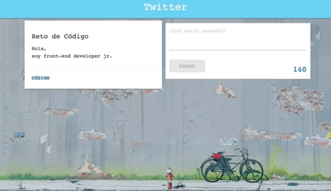

#Twitter

Reto de código  

## Objetivo

El reto consiste en replicar el estilo y funcionalidad de una página sencilla en twitter. 

##Proceso
 
1. Identificar secciones del sitio y como abordarlas.

2. Maquetación. 

	2.1 Empezamos por definir 4 secciones: encabezado, pesentación de usuario, área para ingresar twitter y espacio donde se imprimen los twitter escritos.  

	2.2 El encabezado consta del nombre del sitio en la sección. 

	2.3 Dentro de la presentación de usuario tenemos 3 secciones: 
	  
	  2.3.1  Nombre de usuario.

	  2.3.2  Descripción.

	  2.3.3  Última sección. 

	2.4 Área de inreso de texto. 

	2.5 Espacio donde se muestran los twitters publicados. 

	  
	6. Pie de página con dirección, enlaces a redes sociales, más información y copyright. 

3. Funcionalidad de la página. 

	3.1 Cuadro de ingreso de texto, debe contar los caracteres ingresados y mostrar cuantos quedan disponibles no permite escritura despues de los 140 caracteres. 

	3.2 Se recibe el texto de twitter y debe mostrarse en la sección destinada, junto con la hora de publicación. 

Este deberá ser el resultado aproximado: 

